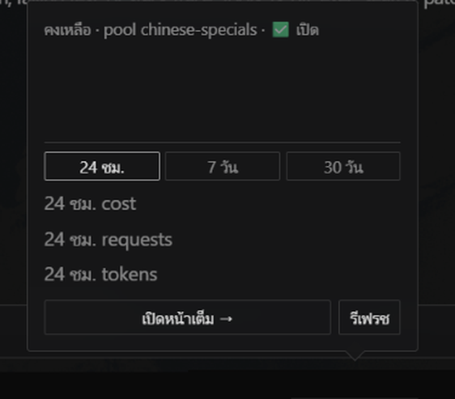

# MaxPlus Credit — ปลั๊กอิน Hermes Desktop

🌏 README in [English](README.en.md)

ดูเครดิต + usage + key ทุก pool ของ [MaxPlus](https://maxplus-ai.cc/invite/ZSPXWCJB) ใน
Hermes Desktop หน้า UI ภาษาไทย


chip + popup สรุป (ยอดเงินถูกปิดในภาพตัวอย่าง):



📖 [ติดตั้งทีละขั้น](docs/INSTALL.th.md) · [Step-by-step install](docs/INSTALL.en.md)

## ติดตั้ง

**Install from Git** (Settings → Plugins) แล้วใส่ repo นี้
หรือกดลิงก์:

```
hermes://plugin/install?repo=Manchinn/hermes-maxplus-credit&enable=1
```

(ลิงก์เปิด dialog ให้กดยืนยันเอง ไม่ติดตั้งอัตโนมัติ)

หลังติดตั้ง ไฟล์จะอยู่ที่ `desktop-plugins/hermes-maxplus-credit/plugin.js`
— ชื่อโฟลเดอร์ใช้ชื่อ repo ส่วน `id` ข้างในคือ `maxplus-credit`
จากนั้นเปิดในแอป: Settings → Plugins → เปิด **MaxPlus Credit**
(มาแบบ opt-in)

> token ไม่ได้อยู่ในโฟลเดอร์นี้ — เก็บใน storage ของแอปตาม `id`
> ลบ/ลงใหม่แล้ว token เดิมยังอยู่

## ใช้งาน

1. เปิดหน้า **MaxPlus** จาก sidebar
2. ใส่ **inference token** (`ccsk-…`) — โชว์เครดิต + usage บัญชี
3. ใส่ **management token** (`ccmk-…`) — โชว์ key ทั้งบัญชีแยกตาม pool
   - scope `keys:read` + `usage:read` ก็พอสำหรับดูอย่างเดียว
   - ติ๊ก `keys:update` เพิ่มถ้าจะย้าย pool / ใส่ cap จากใน plugin

chip ที่ status bar ขวาโชว์ยอดคงเหลือ (`MaxPlus $xx.xx`, poll ทุก 60 วิ) —
กดแล้วเด้ง **popup สรุป** ทันที ไม่ต้องเข้าหน้าเต็ม

ย้าย pool: กด **ย้าย pool · Move** ในการ์ด key → เลือก pool → ยืนยัน
secret เดิมยังใช้ได้ แค่เปลี่ยน base URL ที่ client ให้ตรง
(ปุ่ม base URL กดเพื่อ copy ได้เลย)

usage บัญชี: แท็บ **24 ชม. / 7 วัน / 30 วัน** — โชว์ `requests · tokens · cost`
ของช่วงที่เลือก (ช่วง 24 ชม. รีเฟรชทุก 15 วิ)

ใส่ cap: ถ้ามี key ไม่มี daily cap จะมีแถบ **ใส่ cap** —
ใส่ daily cap ให้ทุก key ที่ขาดทีเดียว (ยืนยันก่อนเสมอ)

> ย้ายแล้ว client ที่ใช้ key นั้นจะ 403 จนกว่า base URL จะตรง —
> อย่าย้าย key ที่งานกำลังรัน

## แต่ละส่วนทำอะไร

| ส่วน | มีอะไร |
| --- | --- |
| chip + popup (status bar ขวา) | ยอดคงเหลือ poll 60 วิ · กดดู popup: ยอด + pool/สถานะ + เครดิตฟรีรายวัน (ถ้ามี) + แถบ cap (เฉพาะ key ที่มี cap) + usage ย่อแบบเลือกช่วงได้ (24 ชม. / 7 วัน / 30 วัน: requests · tokens · cost) + ปุ่มเปิดหน้าเต็ม/รีเฟรช |
| หน้า MaxPlus (`/maxplus`) | hero เครดิต + burn pace + เครดิตฟรีรายวัน · usage บัญชีเป็นแท็บ 24 ชม./7 วัน/30 วัน (`requests · tokens · cost`) · ตาราง key (ค้นหา/กรอง pool/เรียงตามยอด) + ย้าย pool · ใส่ cap · ช่องใส่/ลบ token · เช็กลิสต์เช้า |
| คำสั่ง ⌘K | `MaxPlus: เปิดหน้าสถานะ` · `MaxPlus: รีเฟรชเครดิต` · `MaxPlus: ลบ tokens` |

> **เรื่องยอดเงิน:** `credit_usd` เป็น **ระดับบัญชี** — ทุก pool กินถังเดียวกัน
> จึงไม่มี "ยอดเหลือต่อ pool" ให้แสดง (pool ต่างกันแค่ pricing/model catalog)
> ส่วน **เครดิตฟรีรายวัน** เป็นอีกถังและ **ผูกกับ pool** — plugin จะบอกตรงๆ ว่า
> pool ที่ใส่ token อยู่ใช้เครดิตฟรีได้หรือไม่ (`eligible_for_key_pool`)

## ความเป็นส่วนตัว

- token เก็บใน storage ของแอปเครื่องคนใช้เท่านั้น ไม่ติดไปกับ repo
- plugin ยิง `https://api.maxplus-ai.cc` ตรงจากเครื่องคนใช้
  ไม่มี backend ไม่เก็บข้อมูล
- อ่านอย่างเดียวโดย default — เขียนเกิดแค่ตอนกดยืนยัน (ย้าย pool / freeze / ใส่ cap)

## ไฟล์

| File | คืออะไร |
| --- | --- |
| `plugin.js` | ตัว plugin (ไฟล์เดียว ไม่มี build) |
| `README.md` | ไฟล์นี้ (ไทย) |
| `README.en.md` | เวอร์ชันอังกฤษ |
| `LICENSE` | MIT |

แก้ `plugin.js` แล้ว save — Desktop โหลดใหม่เองในไม่กี่วินาที
(หรือ ⌘K → Reload desktop plugins)

## SDK

ใช้ `@hermes/plugin-sdk` อย่างเดียว (`react`, `react/jsx-runtime`)
อ้างอิง: https://hermes-agent.nousresearch.com/docs/developer-guide/desktop-plugin-sdk

MIT.
