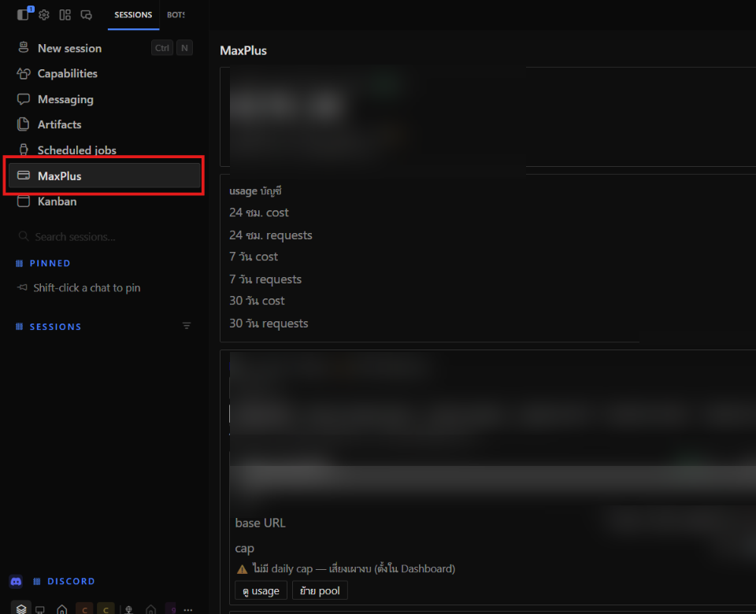

# MaxPlus Credit — ปลั๊กอิน Hermes Desktop

🌏 README in [English](README.en.md)

ดูเครดิต + usage + key ทุก pool ของ [MaxPlus](https://maxplus-ai.cc) ใน
Hermes Desktop หน้า UI สองภาษา (ไทย·English)



📖 [ติดตั้งทีละขั้น](docs/INSTALL.th.md) · [Step-by-step install](docs/INSTALL.en.md)

## ติดตั้ง

**Install from Git** (Settings → Capabilities → Plugins) แล้วใส่ repo นี้
หรือกดลิงก์:

```
hermes://plugin/install?repo=Manchinn/hermes-maxplus-credit&enable=1
```

หรือ CLI (ปักหมุด commit — แนะนำ):

```bash
hermes plugins install Manchinn/hermes-maxplus-credit --ref <40-char-sha> --enable
```

จากนั้นเปิดในแอป: Capabilities → Plugins → เปิด **MaxPlus Credit**
(มาแบบ opt-in)

## ใช้งาน

1. เปิดหน้า **MaxPlus** จาก sidebar
2. ใส่ **inference token** (`ccsk-…`) — โชว์เครดิต + usage บัญชี
3. ใส่ **management token** (`ccmk-…`) — โชว์ key ทั้งบัญชีแยกตาม pool
   - scope `keys:read` + `usage:read` ก็พอสำหรับดูอย่างเดียว
   - ติ๊ก `keys:update` เพิ่มถ้าจะย้าย pool จากใน plugin

ย้าย pool: กด **ย้าย pool · Move** ในการ์ด key → เลือก pool → ยืนยัน
secret เดิมยังใช้ได้ แค่เปลี่ยน base URL ที่ client ให้ตรง
(ปุ่ม base URL กดเพื่อ copy ได้เลย)

> ย้ายแล้ว client ที่ใช้ key นั้นจะ 403 จนกว่า base URL จะตรง —
> อย่าย้าย key ที่งานกำลังรัน

## ความเป็นส่วนตัว

- token เก็บใน storage ของแอปเครื่องคนใช้เท่านั้น ไม่ติดไปกับ repo
- plugin ยิง `https://api.maxplus-ai.cc` ตรงจากเครื่องคนใช้
  ไม่มี backend ไม่เก็บข้อมูล
- อ่านอย่างเดียวโดย default — เขียนเกิดแค่ตอนกดยืนยันย้าย pool

## ไฟล์

| File | คืออะไร |
| --- | --- |
| `plugin.js` | ตัว plugin (ไฟล์เดียว ไม่มี build) |
| `README.md` | ไฟล์นี้ (ไทย) |
| `README.en.md` | เวอร์ชันอังกฤษ |
| `LICENSE` | MIT |

แก้ `plugin.js` แล้ว save — Desktop โหลดใหม่เองในไม่กี่วินาที
(หรือ ⌘K → Reload desktop plugins)

## SDK

ใช้ `@hermes/plugin-sdk` อย่างเดียว (`react`, `react/jsx-runtime`)
อ้างอิง: https://hermes-agent.nousresearch.com/docs/developer-guide/desktop-plugin-sdk

MIT.
