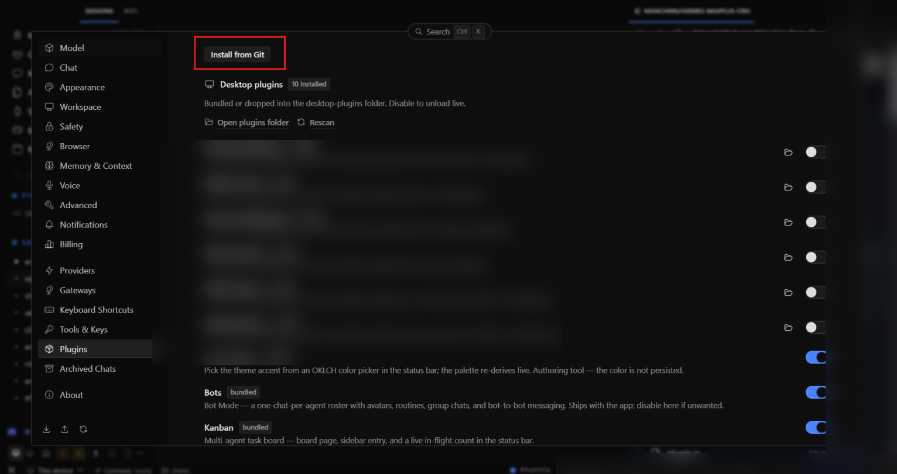

# ติดตั้งทีละขั้น · MaxPlus Credit

> หน้านี้มีภาพประกอบบางส่วน · ภาพที่เหลือทยอยเติม
> This guide is being illustrated — screenshots landing progressively.

## 1. เปิดหน้าติดตั้ง · Open installer

Desktop → **Settings → Plugins** → **Install from Git**
วาง repo นี้ · paste this repo:

```
https://github.com/Manchinn/hermes-maxplus-credit
```



## 2. ตรวจ + ติดตั้ง · Review + install

อ่าน dialog (ชื่อ repo, ไฟล์ที่จะลง) → **Install** → กลับมาหน้า Plugins
เปิดสวิตช์ **MaxPlus Credit** (มาแบบ opt-in) · Review the dialog →
Install → flip the toggle on.


## 3. ใส่ token · Add tokens

เปิดหน้า **MaxPlus** จาก sidebar:

1. ช่อง **inference (ccsk)** — เอา `ccsk-…` จาก
   [MaxPlus Dashboard](https://maxplus-ai.cc/invite/ZSPXWCJB) มาใส่ กดบันทึก ·
   credit + usage บัญชีจะขึ้น
2. ช่อง **management (ccmk)** — สร้างใน Dashboard → API Access
   ติ๊ก `keys:read` + `usage:read` (ดูอย่างเดียว) ·
   ตาราง key ทั้งบัญชีจะขึ้น


## 4. เสร็จ · Done

chip ขวาล่างโชว์ยอดคงเหลือ · The status-bar chip shows your balance.
กด chip หรือ ⌘K → `MaxPlus: …` เพื่อเปิด/รีเฟรช/ลบ token.
